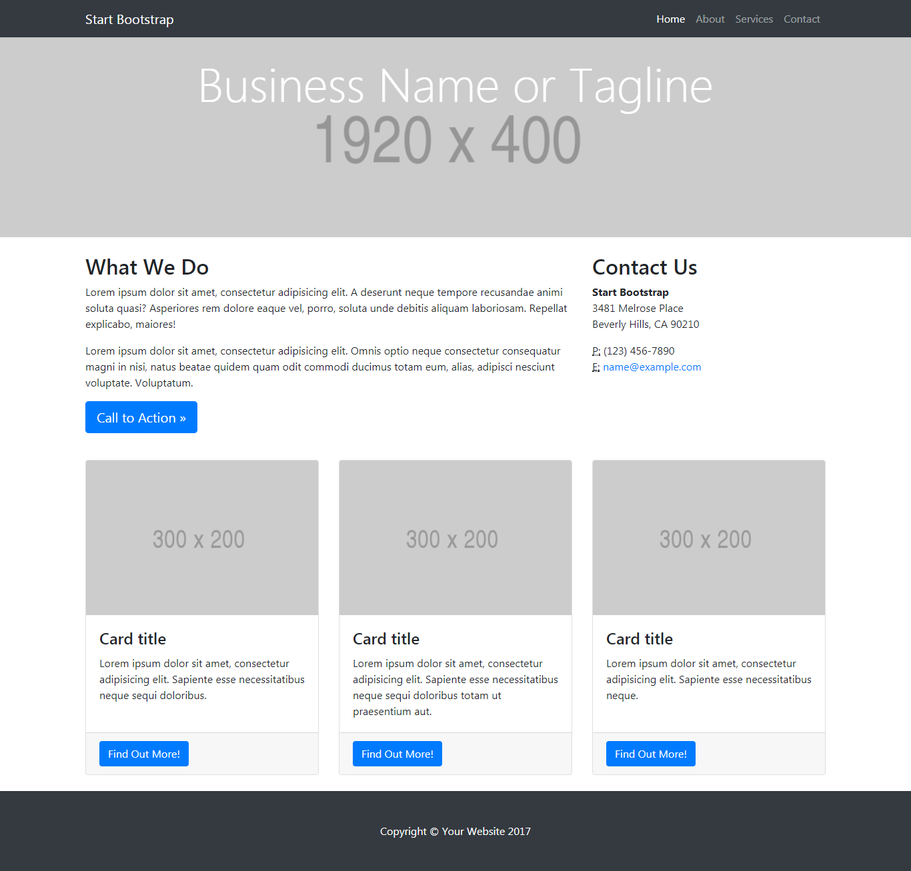
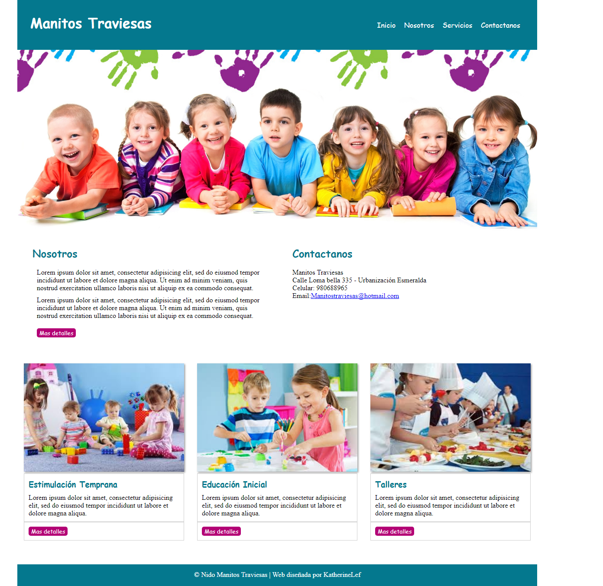

# Freelancer

* **Curso:** _Crea tu propia red social_
* **Unidad:** _La web desde un móvil_

## Objetivo

En este reto, vamos a realizar una página a nuestro gusto.

El diseño lo puedes realizar como mejor te parezca, pero debes mantener la estructura de la página y debes realizarlo con un grid (cualquiera pero que no sea un framework como Bootstrap o Materialize). La estructura de la página es la siguiente:

  

## Resultado

